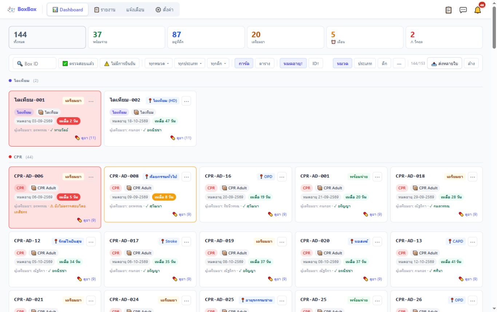
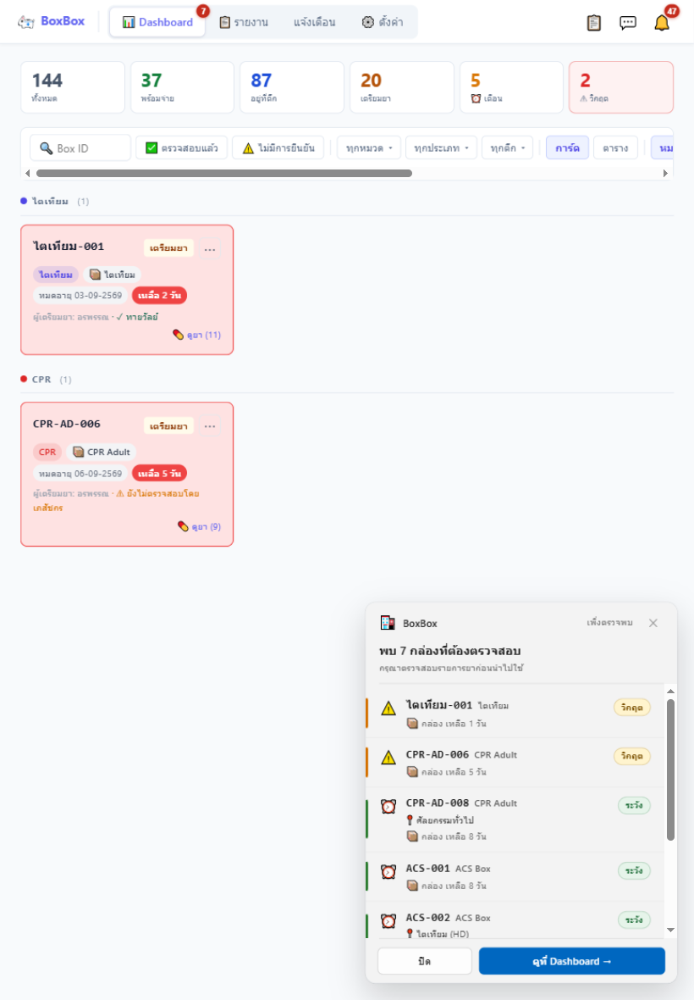

# 📦 BoxBox — ระบบจัดการกล่องยาฉุกเฉิน (Ward Emergency Drug Box)

แอปพลิเคชัน Windows (WinForms + WebView2) สำหรับจัดการกล่องยาฉุกเฉินประจำตึก
ครบวงจร: เติมยา → เบิกออก → แลกเปลี่ยน/คืนกล่อง → ติดตามวันหมดอายุ → แจ้งเตือนผ่าน LINE

## 🌐 ลองใช้งานเว็บเดโม (ข้อมูลทดสอบ)

**→ https://cilforx.github.io/BoxBox/**

เปิดได้ทุกอุปกรณ์ (มือถือ / iPad / คอมพิวเตอร์) ไม่ต้องติดตั้ง
frontend เป็นตัวเดิมทั้งหมด รันด้วย backend จำลอง (mock bridge) + ข้อมูลทดสอบ
การแก้ไขข้อมูลทำได้จริงแต่บันทึกเฉพาะเครื่องของผู้ใช้ ไม่ sync หาใคร

<p align="center">
  <a href="https://cilforx.github.io/BoxBox/">
    
  </a>
  <br/><sub>Dashboard บนจอเดสก์ท็อป — สถานะกล่องทุกตึกแบบเรียลไทม์ (ข้อมูลทดสอบ)</sub>
</p>
<p align="center">
  
  <br/><sub>บน iPad — พร้อม popup แจ้งเตือนกล่องที่ต้องตรวจสอบ</sub>
</p>

> 🖨️ ไฟล์โปสเตอร์ QR สำหรับปริ้น: [`demodata/qr_poster/boxbox_qr_poster_A4.pdf`](demodata/qr_poster/boxbox_qr_poster_A4.pdf)

## การพัฒนาเว็บเดโม

เว็บเดโม build จาก `wwwroot/` แบบไม่แก้ไฟล์เดิม โดยแทรก 2 ไฟล์เฉพาะเดโม:

| ไฟล์ | หน้าที่ |
|---|---|
| `demodata/demo-shim.js` | mock `chrome.webview.hostObjects.bridge` (C# WebBridge) + ดัก fetch ไป Google Apps Script |
| `demodata/*.json` | ข้อมูลทดสอบจากไฟล์ backup ของแอปจริง |

```bash
python demodata/build_web_demo.py   # build → docs/
git add docs && git commit -m "rebuild web demo" && git push
```

Pages serve จาก branch `main` โฟลเดอร์ `/docs`

## 🔐 ทำไม Windows / Chrome ถึงแจ้งเตือนว่าไฟล์ "อันตราย"?

BoxBox **ไม่ใช่ไวรัส** แต่มีพฤติกรรมที่ระบบความปลอดภัยตรวจจับได้:

| สาเหตุ | คำอธิบาย |
|---|---|
| ไม่มี Code Signing Certificate | ใบรับรองราคา 6,000–15,000 บาท/ปี ซึ่งผู้พัฒนาไม่มีงบประมาณส่วนนี้ — SmartScreen จึงเตือนไฟล์ทุกตัวที่ไม่มีใบรับรอง |
| ระบบอัปเดตอัตโนมัติ | ดาวน์โหลดและติดตั้งเวอร์ชันใหม่จาก Google Drive พฤติกรรมคล้าย malware — แต่ BoxBox **ตรวจสอบ SHA-256 ก่อนรันทุกครั้ง** ไม่รันไฟล์ที่ไม่ตรง |
| ใช้ WebView2 + JavaScript Bridge | สถาปัตยกรรมที่ทำให้ UI ยืดหยุ่น แต่ antivirus บางตัวมองว่าเป็นเทคนิคที่ malware ใช้เช่นกัน |

**BoxBox ปลอดภัยครับ** — พัฒนาเพื่อใช้ภายในโรงพยาบาลเท่านั้น โค้ดทั้งหมดเขียนโดยเภสัชกรในกลุ่มงาน
ไม่มีการส่งข้อมูลออกนอกองค์กร นอกจาก Google Sheets ที่ใช้เก็บข้อมูลกล่องยา (ซึ่งผู้บริหารรับทราบ)

### วิธีติดตั้งโดยไม่ให้ Windows บล็อก

1. **SmartScreen** ขึ้น → คลิก *More info* → *Run anyway*
2. **Chrome บล็อกการดาวน์โหลด** → คลิกไอคอนลูกศรข้างไฟล์ → *Keep*
3. **Antivirus บล็อก** → ติดต่อ IT เพื่อเพิ่ม exclusion ใน Windows Defender
   ที่เส้นทาง: `C:\Users\...\AppData\Local\Programs\BoxBox`

### ติดต่อผู้พัฒนา

กลุ่มงานเภสัชกรรม โรงพยาบาลสมเด็จพระยุพราชสว่างแดนดิน
อำเภอสว่างแดนดิน จังหวัดสกลนคร 47110 — อีเมล: [isarak.laokhom@gmail.com](mailto:isarak.laokhom@gmail.com)

## โครงสร้างแอปหลัก (PC)

- `MainForm.cs` + `Bridge/WebBridge.cs` — WebView2 จำลองโดเมน `boxbox.app` → `wwwroot/`, COM bridge ให้ JS เรียกงานพิมพ์ / INVS (SQL Server) / HosXP (MySQL) / LINE / auto-update
- `wwwroot/` — UI เดิม (React 18 + Babel ในเครื่อง), ข้อมูลเก็บ localStorage และ sync ผ่าน Google Apps Script
- `USER_MANUAL.md` — คู่มือผู้ใช้ • `devlog.md` — บันทึกการพัฒนา
